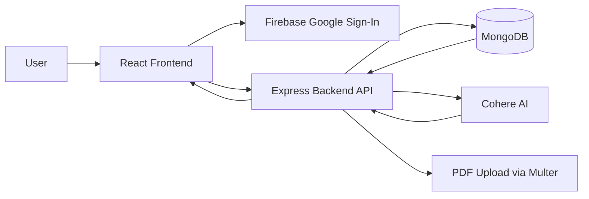
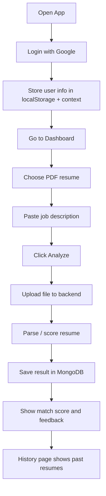

# Public AI Resume MERN

AI-powered resume screening app built with a MERN-style split frontend/backend stack. The app lets a user sign in with Google, upload a PDF resume, paste a job description, and receive an AI-generated match score with feedback. It also keeps resume history for the signed-in user and an admin review view.

## Overview

- Frontend: React + Vite
- Backend: Node.js + Express
- Database: MongoDB + Mongoose
- Auth: Firebase Google sign-in
- File upload: Multer
- AI scoring: Cohere API

## System Architecture



## Application Flow



## Working

### 1. Login

The user signs in with Google using Firebase. After sign-in, the frontend saves the user profile in context and `localStorage`, then navigates to the dashboard.

### 2. Resume Upload and Analysis

On the dashboard, the user:
- selects a PDF resume
- pastes a job description
- clicks Analyze

The frontend sends a multipart request to the backend:
- file field: `resume`
- text fields: `job_desc`, `user`

The backend is expected to:
- validate the upload
- read and parse the PDF
- send the resume text and job description to the AI model
- return a score and feedback
- persist the analysis in MongoDB

### 3. History

The history page reads the signed-in user identifier and requests previous resume analysis records. Each record shows:
- score
- resume name
- feedback
- created date

### 4. Admin View

The app also contains an admin route intended for all submitted resumes across users.

## Main Use Cases

### Use Case 1: Candidate resume screening

- A job seeker logs in with Google.
- They upload a resume and paste a job description.
- The app returns a compatibility score and AI feedback.

### Use Case 2: Track past submissions

- The signed-in user opens History.
- They review previous resume analysis results and scores.

### Use Case 3: Administrative review

- An admin opens the admin page.
- They review submitted resumes across users.

## Project Structure

```text
public_ai_resume_mern-main/
├── backend_ai/
│   ├── Controllers/
│   ├── Models/
│   ├── Routes/
│   ├── uploads/
│   ├── utils/
│   ├── conn.js
│   └── index.js
├── mern_ai/
│   ├── src/
│   │   ├── component/
│   │   ├── utils/
│   │   ├── App.jsx
│   │   ├── main.jsx
│   │   └── App.css
│   └── vite.config.js
└── README.md
```

## API Summary

### User

- `POST /api/user`
- Registers or returns the authenticated user

### Resume

- `POST /api/resume/addResume`
- Uploads a resume and runs AI scoring

- `GET /api/resume/get/:user`
- Returns all resume analyses for a user

- `GET /api/resume/get`
- Returns all resume analyses for admin review

## Setup

### Frontend

```bash
cd mern_ai
npm install
npm run dev
```

### Backend

```bash
cd backend_ai
npm install
npm start
```

## Environment Variables

Recommended backend variables:

```bash
MONGO_URI=your_mongodb_connection_string
```

Recommended AI/auth configuration:

- Firebase is already configured in `mern_ai/src/utils/firebase.jsx`
- Cohere token still needs a valid key in the backend controller before analysis can work end-to-end

## Notes

- The frontend now includes Google login, dashboard upload controls, history loading, and logout.
- The backend connection file now skips DB connection if `MONGO_URI` is not set, so the server can start even in incomplete setups.
- The AI resume analysis controller still needs a full production-ready implementation if you want the upload-and-score flow to work completely.
